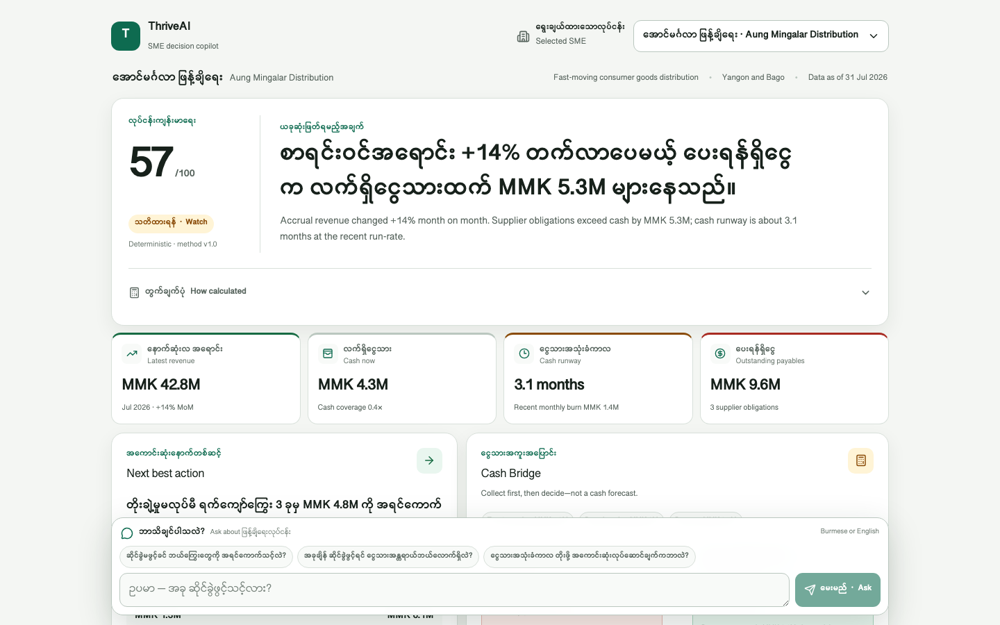
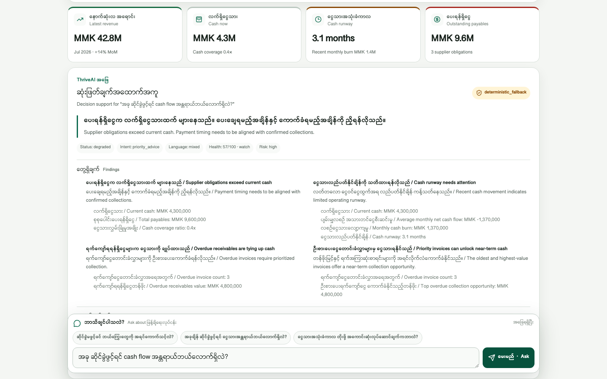
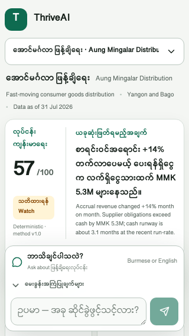

# ThriveAI

**A Burmese-first financial decision copilot that helps Myanmar SMEs turn
business data into a grounded next action.**

ThriveAI combines transparent, deterministic finance with optional contextual
AI. It does not ask a model to do accounting: code calculates the facts, while
AI interprets Burmese or mixed-language intent and ranks relevant, evidence-backed
actions.

## The Myanmar SME problem

An owner can see sales growing and still be unable to pay suppliers or fund the
next move. Revenue, receivables, inventory, and cash often sit in separate
spreadsheets or mental models, making questions such as “Can I safely open
another branch?” difficult to answer quickly. Generic chatbots add another
risk: confident advice without traceable calculations.

ThriveAI demonstrates a practical alternative—local-language decision support
that makes the cash consequence and its assumptions visible.

## Solution and Golden Path

1. Select one of three synthetic Myanmar SME profiles.
2. Review deterministic metrics, health score, risks, and opportunities.
3. Ask a question in Burmese, English, or both.
4. Receive a validated AI-ranked answer when Gemini is configured, or an
   explicitly labeled deterministic fallback.
5. Act on prioritized overdue receivables and the next-best action.
6. Audit the Cash Bridge, then compare editable what-if scenarios.

The default distributor tells the core story: latest revenue is up **14%**, but
MMK **12M** is in receivables, cash is only MMK **4.3M**, and payables are MMK
**9.6M**. Collecting the top three overdue invoices before a branch outlay
changes ending cash from **MMK 1.3M** to **MMK 6.1M**.

## Synthetic personas

- **Shwe Pyi Tea House, Mandalay** — a cash-heavy tea shop with steady growth
  and delivery sales.
- **Mingalar Fashion, Yangon** — a clothing retailer balancing seasonal
  inventory, supplier obligations, and corporate receivables.
- **Aung Mingalar Distribution, Yangon and Bago** — an FMCG distributor with
  revenue momentum but near-term liquidity pressure from slow collections.

All profiles and transactions are synthetic and illustrative.

## Core features

- Burmese-first, responsive single-page decision workspace with English
  supporting copy.
- Four headline metrics, deterministic 0–100 health score, cash runway,
  liquidity ratios, and rule-based risks/opportunities.
- Due-date-aware receivables prioritization with explicit aging and value bands.
- Ranked next actions grounded in the selected business only.
- Auditable Cash Bridge showing current cash, expected collections, branch
  outlay, minimum reserve, reserve gap, and ending cash.
- Six editable sensitivity presets: hiring, inventory, branch, equipment,
  marketing, and custom expense.
- Defensive AI states: timeout, malformed response, provider error, missing
  configuration, cancellation, retry, and stale-response protection.

## Meaningful AI utilization

When `GEMINI_API_KEY` is configured, the server uses the Google GenAI SDK with
**Gemini 3.7 Flash** by default. The model receives the user’s Burmese,
English, or mixed-language question plus a server-built bundle of deterministic
signals and evidence. It returns structured JSON that selects:

- an intent;
- approved finding/signal IDs;
- approved evidence IDs;
- approved action and rationale codes; and
- a contextual action ranking.

This is not a free-form financial answer. Temperature is zero, the response is
constrained by a JSON schema, parsed with Zod, checked for business-scoped
evidence and allowed actions, and given at most one bounded repair attempt.
Only after validation does the server hydrate the selected IDs into reviewed
Burmese/English copy and deterministic values.

A local classifier supports six intents—cash flow, expenses, expansion,
inventory, hiring, and priority advice—and detects Burmese/mixed output
preference. If Gemini is disabled, absent, late, invalid, or unavailable,
ThriveAI returns an honest `deterministic_fallback` with degradation reasons.

## Deterministic finance and trust boundary

Every financial number is calculated in TypeScript from the selected server-side
profile:

- `revenue = sum(revenue category totals)`
- `operating profit = revenue − expenses`
- `growth = (latest month − previous month) ÷ previous month`
- `30-day baseline = average of the latest three monthly records`
- `cash runway = current cash ÷ max(avg cash outflow − avg cash inflow, 0)`
- `quick ratio = (cash + receivables) ÷ payables`
- `current ratio = (cash + receivables + inventory) ÷ payables`
- `net working capital = cash + receivables + inventory − payables`
- `ending cash = current cash + expected collections − decision outlay`
- `required collections = max(0, outlay + reserve − current cash)`
- `scenario monthly cash = baseline net cash + (revenue change × recent cash-realization rate) − expense change`

The health score is a rule-based screening indicator weighted across
profitability (30%), liquidity (25%), cash flow (30%), and growth (15%). The
three-month baseline is a run-rate, and scenario inputs are sensitivities—not
forecasts. The AI cannot create figures or replace these calculations; invalid
model selections are rejected and fall back to deterministic logic. Full
methodology is in [`src/lib/finance/README.md`](src/lib/finance/README.md).

## Architecture and data flow

```text
Synthetic profiles
  -> deterministic finance engine
  -> metrics, health, signals, receivable priorities, scenarios, Cash Bridge
  -> POST /api/analyze with business ID + untrusted question
  -> server rebuilds business-scoped evidence
  -> optional Gemini structured selection
  -> Zod + semantic/evidence validation
  -> reviewed bilingual catalog hydration
  -> UI answer

Any provider or validation failure
  -> labeled deterministic fallback
```

The browser never supplies trusted metrics, and the API response is marked
`no-store`.

## Technology stack

- Next.js 16 App Router, React 19, TypeScript 6, and npm.
- Tailwind CSS 4 for styling.
- Zod 4 for request and model-output validation.
- Google GenAI SDK (`@google/genai`) with optional direct Gemini runtime.
- On Vercel, Gemini 3.7 Flash can also run through AI Gateway using OIDC
  (`VERCEL_OIDC_TOKEN` / `x-vercel-oidc-token`) or `AI_GATEWAY_API_KEY`.
- Lucide React for interface icons.
- Vitest for finance and AI contract tests.
- Playwright for responsive, interaction, fallback, isolation, and screenshot
  smoke checks.
- Live deployment: [https://thriveai-uab.vercel.app](https://thriveai-uab.vercel.app).

## Setup

Requires Node.js **20.9+**.

```bash
npm install
cp .env.example .env.local
npm run dev
```

Open [http://localhost:3000](http://localhost:3000).

Environment variables:

- `GEMINI_API_KEY` — optional Google AI Studio key. When set, the API uses the
  official Gemini SDK.
- `AI_GATEWAY_API_KEY` — optional Vercel AI Gateway key for local model access
  without a Google key. Production on Vercel can use OIDC instead.
- `AI_MODEL` — optional model override; defaults to `gemini-3.7-flash`.
- `AI_TIMEOUT_MS` — optional deadline; defaults to `8000` and is bounded from
  1,000 to 15,000 milliseconds.
- `AI_ENABLED` — set to `false`, `0`, or `off` to force deterministic mode.

Do not expose the API key through a `NEXT_PUBLIC_` variable.

## Verification

```bash
npm run lint
npm run typecheck
npm test
npm run build
BASE_URL=http://127.0.0.1:3000 npm run test:browser
```

Current verified scope:

- ESLint, TypeScript, and the optimized Next.js production build pass.
- **43 Vitest tests across 5 files pass**, covering profile fixtures, core
  calculations, three-month baseline, liquidity, health scoring, overdue
  prioritization, signals, six scenarios, Cash Bridge invariants, Burmese/mixed
  intent, request validation, provider failures, timeout/repair behavior,
  prompt injection, and cross-business evidence isolation.
- The Playwright script checks desktop/mobile overflow, required Cash Bridge
  values, fallback interaction, persona reset, scenario editing, prompt-injection
  rendering, 44px mobile controls, and creates the three screenshots below.
  It was not rerun during this documentation-only pass because it writes those
  screenshot artifacts.
- Production Gemini is attempted through Vercel AI Gateway OIDC when no
  `GEMINI_API_KEY` is set. Local runs still fall back honestly without a key.

## Screenshots







## Live Demo

[https://thriveai-uab.vercel.app](https://thriveai-uab.vercel.app)

Production uses Vercel AI Gateway OIDC for Gemini 3.7 Flash when no Google
key is configured. If the gateway is unavailable, `/api/analyze` still returns
an honestly labeled `deterministic_fallback`.

## How Cursor was used

The build used Cursor for parent orchestration, scoped parallel implementation,
debugging, and verification. The **Parent Orchestrator** froze file ownership,
sequenced work, integrated the vertical slice, and reran project-level checks.
Exactly five named specialized agents contributed:

1. **SME Strategy Agent** — froze the P0 decision story, realism constraints,
   Cash Bridge demo, and final submission narrative.
2. **Core Engineering Agent** — scaffolded the app and implemented synthetic
   profiles, deterministic finance, scenarios, Cash Bridge, and finance tests.
3. **Product & UX Agent** — implemented and debugged the responsive
   Burmese-first decision workspace, AI client states, and accessible mobile
   behavior.
4. **AI Financial Intelligence Agent** — implemented the Gemini structured
   selection path, validation/repair boundary, deterministic fallback, and AI
   contract tests.
5. **QA / Red-Team / Release Agent** — defined the risk-based acceptance matrix
   for finance, AI safety, security, responsive behavior, and deployment
   readiness, then was assigned the final read-only release audit.

## Third-party resources and disclosure

This prototype uses Next.js, React, TypeScript, Tailwind CSS, Zod, the Google
GenAI SDK with Gemini as an optional runtime, Vercel AI Gateway for hosted
Gemini access, Lucide React, Vitest, and Playwright. Hosting is Vercel.
Package versions are recorded in `package.json` and `package-lock.json`.

No external dataset, bank data, customer data, proprietary model, paid design
asset, or third-party financial benchmark is included. The three SME profiles,
invoice records, and financial histories are synthetic. Gemini is called only
at runtime when a Google key, AI Gateway key, or Vercel OIDC token is present.

## Limitations

- Data is synthetic; results have not been validated with real SMEs or UAB
  customers.
- Baselines, health scores, risks, and fallback actions are rule-based
  prototypes, not accounting opinions or forecasts.
- Straight-line scenarios omit tax, financing, inflation, seasonality,
  replenishment cycles, probability, and unexpected shocks.
- Expected collections are assumptions, not collection predictions.
- ThriveAI does not make lending, credit, eligibility, underwriting, or
  investment decisions.
- Without a Gemini key—or on any model failure—the product uses a clearly
  labeled deterministic fallback.
- The prototype has no production authentication, persistence, bank
  integration, audit controls, or guarantees of production security,
  accounting correctness, or regulatory compliance.
- Burmese copy and financial methodology require review by native-language,
  accounting, security, privacy, and compliance specialists before real use.

## Future potential

With consent and production controls, ThriveAI could ingest accounting or bank
transaction feeds, support sector-specific benchmarks, learn collection
patterns, add probabilistic cash forecasting, and help relationship managers
prepare more focused SME conversations. Native-speaker SME research, explainable
model evaluation, secure tenancy, audit logs, and privacy-by-design data
governance would come before any real financial deployment.

See [`docs/pitch-and-qa.md`](docs/pitch-and-qa.md) for the 90-second demo and
judge Q&A.
